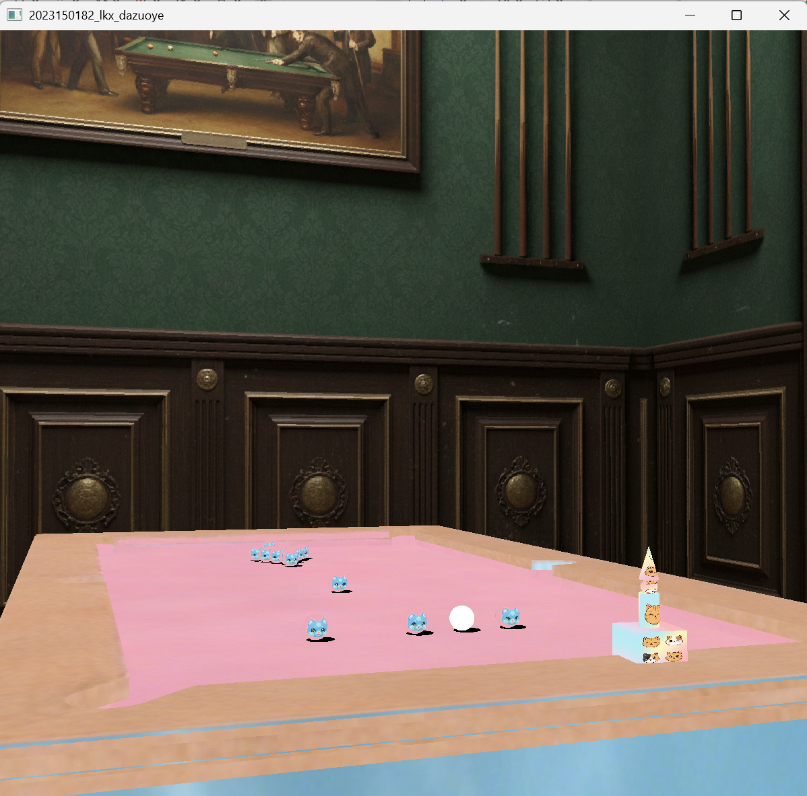

# OpenGL Billiards

一个基于 C++ / OpenGL 的 3D 台球交互场景。项目围绕实时渲染、基础物理模拟、纹理材质、光照阴影和层级建模展开，呈现一个可以自由观察、击球、调光并与机械臂互动的桌球空间。



## 功能亮点

- **完整 3D 台球场景**：包含台球桌、球体、地面、天空盒、贴图材质与 OBJ/OFF 模型加载。
- **基础台球物理**：实现球体运动、摩擦减速、边界反弹、球与球碰撞、入袋检测与重置逻辑。
- **动态视觉反馈**：碰撞时球体产生弹性形变，入袋时触发彩色粒子效果，让交互反馈更鲜活。
- **光照与阴影**：使用 Phong 光照模型、材质高光、纹理采样与投影阴影增强空间层次。
- **自由相机与可调光源**：支持键盘、鼠标和滚轮控制观察视角，也可以实时移动光源位置。
- **层级机械臂交互**：通过层级建模构建机械臂，支持关节控制、沿台面移动、标记最近目标球并执行移除效果。

## 技术栈

- C++11
- OpenGL 3.3 Core Profile
- GLFW
- GLAD
- GLM
- CMake
- stb_image

## 项目结构

```text
OpenGL-Billiards/
├─ README.md
├─ docs/
│  └─ preview.png
├─ release/
│  └─ windows/
│     ├─ OpenGLBilliards.exe
│     ├─ glfw3.dll
│     ├─ assets/
│     └─ shaders/
└─ src/
   ├─ CMakeLists.txt
   ├─ main.cpp
   ├─ InitShader.cpp
   ├─ MeshPainter.cpp
   ├─ TriMesh.cpp
   ├─ include/
   ├─ assets/
   └─ shaders/
```

## 构建与运行

### 运行 Windows 预编译版本

进入 `release/windows/`，双击运行：

```text
OpenGLBilliards.exe
```

预编译版本需要同目录下的 `glfw3.dll`、`assets/` 和 `shaders/`，请保持目录结构不变。

### 从源码构建

构建前请准备 CMake、支持 C++11 的编译器，并通过 vcpkg 安装依赖：

```powershell
vcpkg install glad glfw3 glm
```

然后在 `src/` 目录配置并构建：

```powershell
cd src
cmake -S . -B build -DCMAKE_TOOLCHAIN_FILE="$env:VCPKG_ROOT/scripts/buildsystems/vcpkg.cmake"
cmake --build build --config Release
```

项目会将可执行文件输出到 `src/` 目录，运行时会从当前目录读取 `assets/` 与 `shaders/`。

## 操作说明

### 模式切换

- `Shift + 1`：相机控制
- `Shift + 2`：测试平面控制
- `Shift + 3`：击球模式
- `Shift + 4`：机械臂控制
- `Shift + 5`：光源控制

### 相机控制

- `W / A / S / D`：前后左右移动
- `Z / X`：上升 / 下降
- `Q / E`：左右旋转视角
- `R / F`：上下旋转视角
- 鼠标移动：平滑环视
- 鼠标滚轮：缩放视野
- `T`：锁定或恢复鼠标视角控制

### 台球与机械臂

- `I`：重置白球
- `Shift + I`：重置全部球
- `P / O`：测试击球力度
- 机械臂模式下 `1 / 2 / 3 / 4`：选择底座、大臂、小臂、末端关节
- 机械臂模式下 `A / S`：调整当前关节角度
- 机械臂模式下 `W / D`：沿台面移动机械臂
- 机械臂模式下 `5`：标记最近目标球
- 机械臂模式下 `Q`：移除已标记目标球

### 光源控制

- `W / S`：沿 Z 轴移动光源
- `A / D`：沿 X 轴移动光源
- `R / F`：沿 Y 轴移动光源
- `ESC`：退出程序

## 实现概览

- `main.cpp` 负责场景初始化、主循环、输入响应、台球状态更新、机械臂动画和特效调度。
- `TriMesh` 封装基础几何体生成、OBJ/OFF 模型读取、材质与顶点数据管理。
- `MeshPainter` 负责 VAO/VBO 绑定、纹理加载、着色器程序创建和绘制调用。
- `Camera` 提供基于欧拉角的自由相机、透视/正交投影和鼠标滚轮缩放。
- `BALLS` 管理台球位置、速度、加速度、碰撞、反弹、入袋与重置状态。

## 展示定位

这个项目重点展示了在原生 OpenGL 管线中组织一个可交互 3D 场景的完整过程：从资源加载、矩阵变换、光照材质，到物理反馈、粒子效果和多模式输入控制。它不是一个完整商业台球游戏，而是一个面向实时图形学与交互系统实现的作品集项目。
